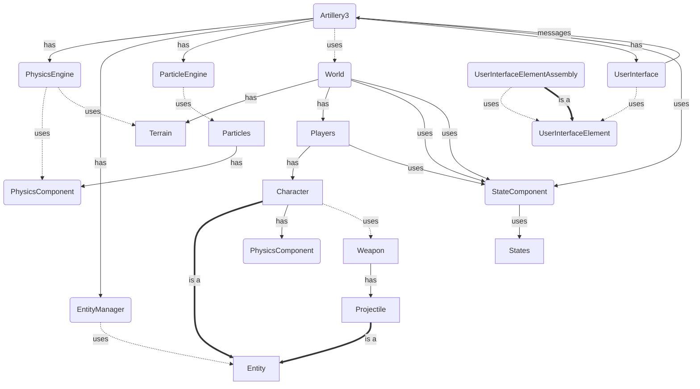

## Preface

High distinction project:

Will StateMachine research be OK?

## 1.1 Required Roles

```mermaid
graph TD


A(Artillery3) -- has--> P(PhysicsEngine)
A --has--> Em(EntityManager)
A --has--> Pe(ParticleEngine)
A -. uses .-> W(World)

Pe -. uses .-> Particles
Particles --has-->Pc1


Players --has--> Character

P -. uses .-> Pc1(PhysicsComponent)

Em -. uses .-> Entity
Character ==is a ==> Entity
Character --has-->Pc2(PhysicsComponent)
Projectile ==is a==> Entity

Character -. uses .-> Weapon
Weapon -- has --> Projectile


W --has-->Terrain
W--has-->Players
P-.uses.->Terrain

A--has-->UI(UserInterface)
UI--messages-->A
UI-. uses .->UIE(UserInterfaceElement)
UIEA(UserInterfaceElementAssembly) -. uses .-> UIE
UIEA == is a ==>UIE

SC1 -- uses --> States

W--uses-->SC1(StateComponent)
Players--uses-->SC1
W--uses-->SC1
A -- uses --> SC1


```

