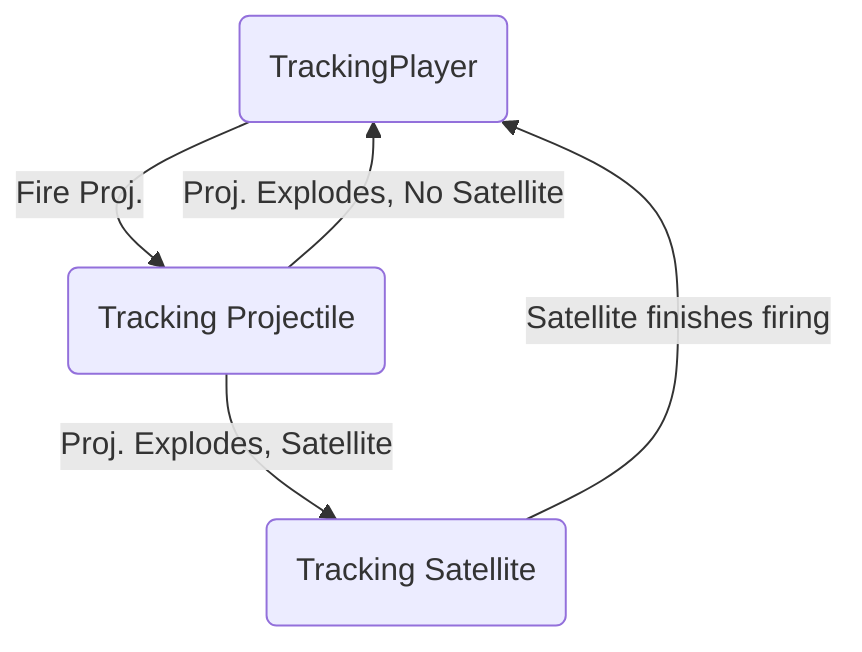

# Object Oriented Programming: Crash Course

written by mikanwolfe, mikanwolfe@nekox.net

---

### Preface

I know this document is long, but the first 80% is the important stuff that we have to get out of the way first. Head to [Design Patterns](#design-patterns) to see the good stuff. This is also designed as a webpage/web post. Head to [https://nekox.net/oop-crash-course/](https://nekox.net/oop-crash-course/) to see the page in action. As a bonus, it's actually hosted with GitHub pages!

---

[TOC]


---

## Introduction

Though there have been many paradigms throughout the history of computer programming, none are as iconic and popular as Object-Oriented (OO) Programming--and for good reason.

Object Oriented Programming is the practice of composing programs from objects and their data as opposed to a grocery-list styled procedural program where they are executed from top to bottom. This allows for a more natural and in some way, efficient programming practice as it encourages modularity and code reuse. 

## A classy-shooty example

One of the issues with OO programming when explaining it is often the concept of classes. Some people just want names to mean something: 'class' is too vague of a word to make that work.

Let's take warships as an example and then we'll move onto some artillery pieces.

#### Classes and Objects

A certain number of years ago there existed a really big chunck of steel floating on the ocean known as the **Queen Elizabeth-class** battleship. Of the **Queen Elizabeth-class** battleships were two famous ships: **HMS Warspite** and **HMS Queen Elizabeth**. 

We can say that HMS Warspite and HMS Queen Elizabeth are members of the Queen Elizabeth-Class of battleships. 

- Warspite and Queen Elizabeth are objects of the Queen Elizabeth Class
- Warspite and Queen Elizabeth are different ships of the same model: they have the same calibre of guns, armour, layout, but they are not the same object. 
- Warspite and Queen Elizabeth have slightly different information that they hold: they have different names, and different naval personnel on board.
  - Think that the *type* of data is the same (string, people) but the contents are different.

The class of battleship is not a tangible thing: it represents the class of ships that exist but the pure class itself is just an idea; the pure class is a blueprint that is used to make the ships.

Similar to classes, **interfaces** are a funny imaginary beast like most prominent religious figures. In essence, they define that a class has defined inputs and outputs, and acts as a contract that the object must uphold. 

On HMS Warspite, her majesty has four turrets mounting twin 381mm guns. On the other hand, if you, the ever-smart Admiral you are, wanted to replace the guns with smaller ones that could fire faster, you need to make sure that the turret your engineers select actually fit onto the warship. In essence, the turret mount is the interface--it defines the size of the turret, how it must rotate, how it loads, and how it fires (because turrets are just decorations if they can't fire). 

The use of **interfaces** allows objects to be treated as solely interfaces in some higher-level applications, such as Artillery3 (A3). A3 treats anything that implements the `IWeapon` interface as a weapon as long as it implements commands to fire, charge, depress, and even elevate. Hence, any weapon that implements those methods can be treated like a weapon, allowing for flexibility of treating one object as another. Frankly, a duck can be treated as a weapon as long as it implements those methods.

Go figure. 


### Abstraction

We don't often think about the many-thousands of horsepower triple-quadruple-quintuple expansion steam engines that drive Queen Warspite, however-many propellers there are under the waterline. You just yell through some brass tubes to someone else to get their ~~as- haulin--~~moving. This way, a lot of the functions of the Her-Majesty's-Ship (HMS) Her-Majesty (Queen Elizabeth) (did no one think that through?) are *abstractions.*

### Encapsulation and Information Hiding

Putting everything into one box: the methods, the data, and the cats, is known as encapsulation. Hiding whatever you've stolen and put inside is known as Information Hiding. They're very similar in that they both surreptitiously put things you don't about into mysterious ~~pills~~ capsules known as objects.

Information Hiding tends to refer to the access levels that an object can feature, often read and written about as *private, protected,*and *public* members. For example, taking the big-boom example from earlier, a warship often has guns inside turrets. This is a *protected* or even *private* function, accessible only within the turret. On the other hand, a turret should be exposing it's `shoot()` function to allow the ship to control the turret. A perfect example of this in A3 is Characters (Artillery pieces) exposing their `shoot()` function to the player so that they can shoot. 

### Polymorphism

On the other hand, it turns out other ~~bottlesheeps~~ battleships like *Kongou* exist! They are both battleships, hence, it turns out that they're both inherited from a super-battleship class!

By inheritance in OO Programming, we mean that classes can *inherit the properties and methods* of a parent class. This allows the child class to specialise and extend the class, such as defining the specific class of battleship we're talking about or in the case of A3--how a character is inherited from an entity. Both projectiles and characters are entities as they share common traits, yet they both expand on the concept of entity and specialise the class down to a very specific role (the shootee and shooter).

### Coupling and Cohesion

The oddities of OO design, Coupling refers to the level of interconnectedness between objects. In A3, coupling is can be seen in the abstract factory design used in terrain generation. The World of A3 doesn't need to know anything about the terrain it is generating nor the details of how it is generated: it just creates a factory and tells the factory to make the terrain. This is *decoupling* the world and the generation of the terrain.

Cohesion is a little easier to understand: the gun should only be a gun. It is the gunniest of all guns and nothing will be more gun-like than The Gun. Doesn't do anything else though. By highly specialising a class it allows more concrete responsibility design and reduces overlap in responsibilities by objects. In A3, it'd probably be the guns.

## Responsibility-Driven Design

OO programming is arguably more about design than it is about the actual programming itself. It's quite difficult to really create elegant or neat code that works since most code is an iterative process and trying to create a perfect system or scaffolding at the very start of the project is an fool's errand. 

### Roles

There exists in this endless canvas of blue: steel warships, guns, shells, gunpowder, armour, personnel, aircraft, torpedoes, smoke. Out on the azure lanes we see steel giants (and for some reason, small cute girls) battling it out for naval superiority. There are Torpedo Boats, Destroyers, Cruisers-- Light... and the list goes on. 

### Responsibilities

Roles have responsibilities: aircraft must fly, they then drop bombs, torpedoes, and the like. The responsibilities often supersede the objects themselves: the ocean must hold up all the warships, the planes must be able to pack themselves inside Aircraft Carriers, and physics must work. This defines the fields and methods of each individual role in the form of objects, and the specialisation of these roles allows you to start defining the relationships between objects.

### Collaborations 

As our objects grow, they need to interact somehow. Collaborations defines the intrinsic relational relationship between objects: the world has an ocean, the ocean holds ships, the ships hold planes or guns. There are actually different types of collaborations, but three simple ones are: "uses", "has-a", and "is-a-kind of", being Dependency, Association, and Inheritance respectively. 

Aircraft Carriers "use" aircraft, they "have" an engine, and they "are-a-kind of" warship. Easy.

## Design Patterns

The formal version of copy-paste code, design patterns are ways of designing OO programs that very smart people have thought about and us not-so-smart people can use to solve common problems.

#### Concept of Composition

Composition, as described "favoured" by the Gang Of Four, is the concept that we should try to use composition over inheritance. Your pay as a programmer is not how pretty your Christmas-tree of inheritance hierarchies are, but the effectiveness and efficiency of your program. Hence, the concept of composition boils down to favouring the use of interfaces along with putting component objects within a parent object to allow for flexibility since multiple-inheritance is baaaad. Japan tried to cross a Submarine and Aircraft Carrier once. It was not very effective. 

Look for PhysicsComponents of Artillery3 -- all the compositions literally have the word 'Component' inside the class name. (StateComponent, ObserverComponent, etc.)

##### Singleton

Look Ma! It's a **<em><u>GLOBAL VARIABLE!!1!1!!!</u></em>**

Jokes aside, they really are global objects, and for good reason. In A3, there only needs to be **one** physics engine. Any more and we introduce multiverses and all that bad stuff--no, using Singletons often are more useful for enforcing only one instance of one object to exist at all times. It allows, at least in A3, for Physics Components to register themselves with the Physics Engine without having the Physics Engine reference being passed down through the Christmas tree since, well, if you're using a physics component, there's a physics engine involved for handling collision.

##### Command

I mean, why not have more objects? Commands are turning method calls into objects to decouple objects from the input. The game could call a player to move based on the input from the human on the other side of this screen, however, that involves all parties knowing things... some objects don't want known.

In A3, the use of Commands means that the only the InputHandler knows what the user entered, but never the key the user typed nor the command that is being passed other than that it's of class `command` -- this is then executed with the correct character only through `command.execute()`, never directly calling the character's methods. Again, more classes for more decoupling. 

##### Composite

I heard you like bags, so we put a bag in a bag in a bag a bag in a bag in ...

```
void ILikeBags(){
	if (!bag.exists)
		print("I heard you like bags, so we put ")
    print("a bag in ")
    ILikeBags()
}
```

 Composites involve treating collections of objects as **the object** itself. Though we could go into the SwinAdventure bag example, in A3 the concept of Entities and EntityAssemblies is a composite pattern. In formal terms, the branches are the EntityAssemblies and the Entities are the leaves/end nodes of the pattern. In conceptual terms, a Character is an assembly that can have hulls, weapons, and other attachments, each of which are entities. As assemblies are considered entities, putting an assembly within a character would be the same as putting in an entity.

To update all the entities? `entites.update()`

That calls all the update functions, and the assemblies will call the update functions of their assemblies. Draw works the same way.

##### Abstract Factory

Originally a Strategy Pattern (which will be implemented later for projectile flight), abstract factory is simply delegating the creation of an object/instantiation to another class. It's best described by code here:

```
TerrainFactory _terrainFactory = new TerrainFactoryMidpoint();
_terrainMidP = _terrainFactory.Generate();

_terrainFactory = new TerrainFactoryRandom();
_terrainRand = _terrainFactory.Generate();            
            
```

By delegating the construction of the terrain to the factory class, in a more developed version of A3, the abstract factory can be supplied by either the UI or a parent class. This means that in order to generate the terrain, all one needs to do is to call `_terrainFactory.Generate()`. 

This is useful as there are often similar things we want to make but we don't want to be explicit about it-- that is, we don't want to hard code the objects we're making in this class *right now* or it may change later down. Hence, we create an object that does creation for us, the object can be replaced at any time (decoupling once again).

##### Observer

Similar to events but different depending on the person, observers notify subjects of events when something happens. I do plan on using this for UI and achievements later down the line, however, their current implementation in A3 is for ending player turns.

Observers "watch" objects by registering themselves with the object to get notified if something "interesting" happens. In the case of A3, the World registers itself with players such that, when the player finally ends the turn, the World is notified to move on with the game. Otherwise, the world would constantly have to check in on players to see their current progress and it can consume valuable resources or in my case, create unnecessary coupling between the player and world as the world would have to both check if a player is "finished" with their turn and then the world itself would have to change the state of the next player--coupling too high.

By separating the notifications between the player and the world, the players don't need to exist for the world to progress.

##### Strategy

This has not been implemented yet (though it was originally used for terrain generation), the strategy pattern involves switching implementations of a methods through objects. For example, the flight path of objects should be defined by a parabolic arc, however, some objects might split so they have additional parameters or they might have a "homing" capability. Hence, as they all do similar things, the strategy object takes input parameters and adjusts the position of the projectile based on it's internal *strategy*.

This is much more complex in A3 due to the implementation of the Physics Engine.

#### Game Design Patterns

These patterns are somewhat specific to games, however, they are design patterns nonetheless.

##### Game Loop

Draw, Update, Handle Input. The core of all games is the *Game Loop* which is also related to the very common use of the *GameObject* class which has Draw and Update methods, with any and all game thingies inheriting from the *GameObject* class. This standardises the method of which objects interact and progress through time. 

Very, very, very, useful.

##### Finite State Machine / Pushdown Automata (Game Ver.)

**Update: 01/05/19**

Artillery3 has gone through a lot of updates since this document was written and now implements C# Events, the Observer Pattern, and a multitude of Finite State Machines--following the Mealy State Machine design with a stack, qualifying it for the title of "Pushdown Automata". This section  might be a bit easier to describe in examples and a bit of Mermaid syntax, if I remember any.

**The concept of a State Machine**

Think of a traffic light: Green? Yellow... Red. They're "States" of the light. Think of Artillery3--We're watching the player, then the projectile, then we switch to another player. These are *States* of the world. State machines could have an entire research project dedicated to them, but the gist of State Machine use in Artillery3 boil down to a few important concepts:

* The state is implemented as a component of any class,
* The state switching method describes the transient responses of the machine,
* The states of the machine are described in the update function.

We can look at a normal mealy state machine for reference:



Though not strictly mealy, there decisions are made only within states and not in transitions. Transition states can perform tasks once whilst the state will be repeatedly called.

There are at current, two locations where the stack is utilised for persistent memory: UI state loading and the "Escape" menu.

* UI Persistent Loading
  * Since the UI sends an event to A3 to change the state, the collection the UI element that sent the event is in will be modified. This is due to the UI's design, which throws away unused UI elements when the state changes, hence, this creates a catch-22.
    The UI throws the event, but in doing so, changes the state of A3. The change in state will remove the old UI, which is still active during the event.
  * To solve this, the next state and a special "Loading" state is pushed to the stack. In the menu, it should appear like so: {MainMenu, Combat, Loading}.
    * As A3 loops through the Update() method, the loading state's job will be to remove itself and change the state to the one before it. For example, in the three-state stack above, the stack will follow this sequence:
    * Pop Loading: {MainMenu, Combat}
    * Pop "Next State" {MainMenu}, NextState = Combat
    * Switch to "Next State" {Combat}
* Escape Menu
  * An exception to ALL states, pressing the ESC button anywhere will push the EscMenu state onto the stack. At the Esc Menu, pressing ESC will pop it off the stack and exactly back to where it was before.
  * This, in effect, pauses the entire game and works as a rather functional interrupt menu without using system interrupts and dealing with disabling entities/functions (as not calling update by it's nature pauses everything).

Here's an example implementation in fake c#:

```csharp

Class World {
	StateComponent _state
	
	
	void Update() {
	
	switch(PeakState()) {
		
            //Do stuff here the world always needs to do
            // E.g. update players
            // E.g. HandleInput
            // E.g. Countdowns
            
        case TrackingPlayer:
            //Do stuff here to track player
            
            break;
            
        case EndGame: 
            //Do stuff when the game ends
            break;
		}
	}
	
	
	
	void SwitchState(State bextState) {
        // A very important function used to track the transient 
        // states of each state (the transitions, if you will)
		switch(PeakState()) {
                
            case TrackingPlayer:
                //Current state is tracking player.
                //Use if/switch to figure out which is next
                // and execute the transition code

                break;
		}
	
		_state.SwitchState(nextState)
	}
	
	void PushState(State state) {
		_state.Push(state)
	
	}
	
	State PeekState() {
		return _state.Peek();
	}
	}


```


**Legacy: On the website**

I've saved this for last as it is the fuzziest for me, personally. Coming from a slightly-VHDL and basic microcontroller background, the concept of Mealy and Moore state machines seem to be akin to the Finite State Machines (FSM) of the Computer Science World. Expanding on this is the concept of *Automata*, in which a FSM is a form of. *Pushdown Automata* is the implementation of Stacks upon *Automata*. 

In games, this is used in Game States and not actual Automata. Consider a user interface in a game: 

* Open the Esc. Menu
* Open Settings
* Open the Controls Tab
* Open the Hotkeys Window
* Open the Change a HotKey Window
* Open the Controller Mapper

Now we're 6-7 GUIs in and completely lost. How do we get out? Normally, states don't actually contain information from whence they came. This is problematic as under a normal FSM:

*  You're in the Controller Mapper

Now let's head back, but to where!? How do we know where we came from? Since there are many ways to enter this GUI, it gets messy. Using a stack allows us to "Stack" states atop one another so that we can just "pop" states when where we need to take a detour and head back into that original state easily.


---

And that's all, folks


 